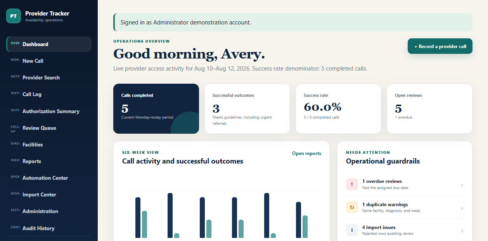
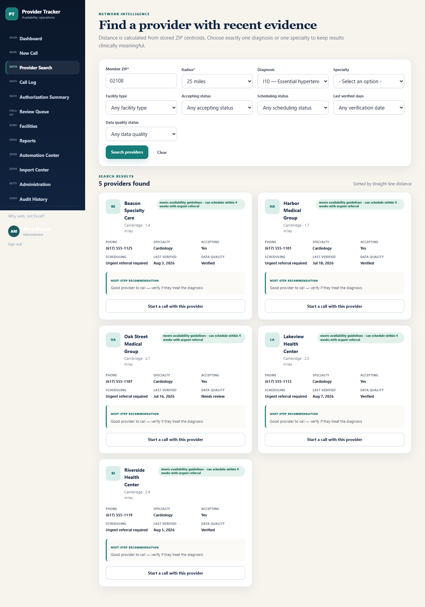
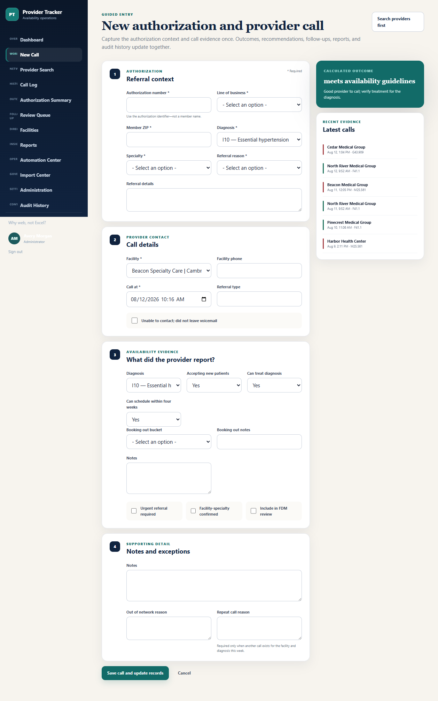
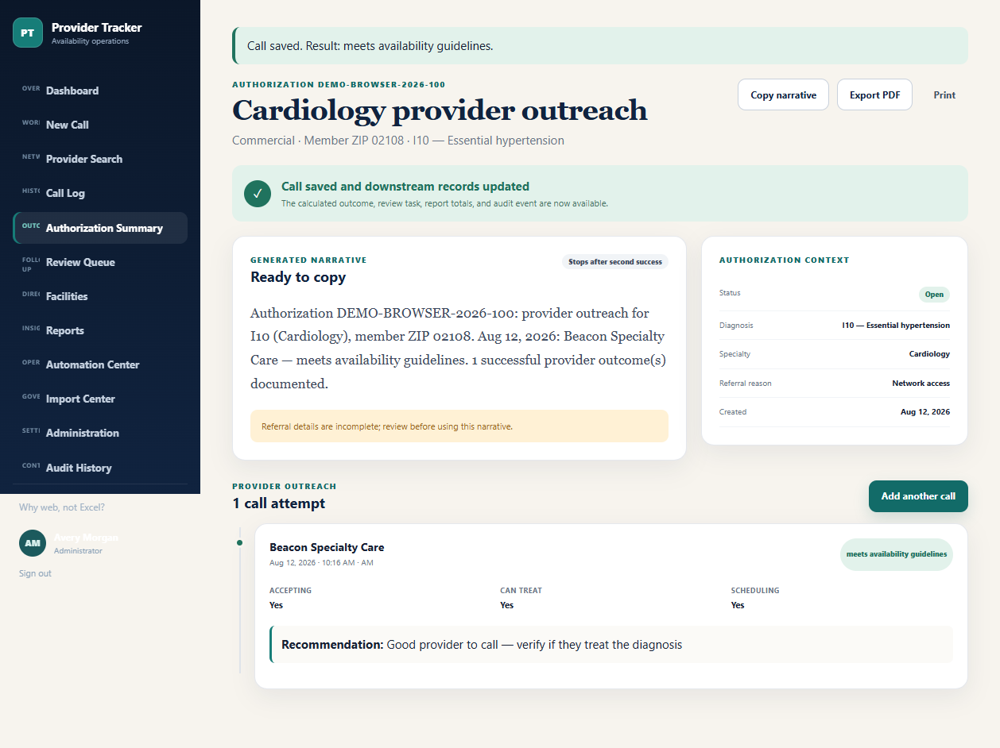

# Provider Tracker

Provider Tracker is a Django operations platform for managing provider availability research. It replaces split spreadsheet workflows with one validated database, guided call entry, geographic provider search, automatic follow-up work, reproducible reports, and an auditable history.

The public demonstration contains only deterministic, fictional records. It is not configured or approved for regulated production data.



<details>
<summary>More application screenshots</summary>







</details>

## Demonstration workflows

- Create an authorization and provider call in one validated transaction.
- Calculate availability outcomes and seven-day recommendations from versioned server-side rules.
- Search nearby facilities by ZIP, radius, diagnosis or specialty, and recent evidence.
- Detect same-week duplicate calls while allowing documented legitimate callbacks.
- Generate authorization narratives that stop after the second successful provider.
- Assign and resolve follow-up, duplicate, stale-evidence, coordinate, and import review work.
- Filter and paginate the canonical call log; export CSV or professionally formatted Excel.
- Explore weekly, monthly, and filtered metrics with stated periods and denominators.
- Save reproducible report snapshots and run visible, idempotent automations.
- Preview and apply recognized workbooks through a quarantining, provenance-preserving importer.
- Review material changes in a role-protected audit history.

| Workbook limitation | Application improvement |
|---|---|
| Split admin and user files | One canonical database |
| Recalculation and fixed formula ranges | Targeted, tested services and indexed queries |
| Positional column drift | Header-driven import and named fields |
| Manual follow-up tracking | Automatic review queue |
| Cached report sheets | Live metrics and reproducible snapshots |
| Difficult concurrent editing | Authenticated, role-based multiuser access |

## Architecture

- **Web:** Django 6.1 templates, semantic HTML, HTMX-enhanced filtering, and a responsive local design system.
- **Domain:** Django forms for validation, thin views, selectors/repositories for data access, and services for business rules and transactions.
- **Local demo:** SQLite, eager background tasks, numeric coordinates, bounding-box prefiltering, and final Haversine distance calculation.
- **Production path:** PostgreSQL/PostGIS stored geography points with a GiST index, `ST_DWithin`/`ST_Distance`, Redis, Celery workers, and scheduled task evaluation.
- **Governance:** UUID business records, source provenance, row-level import results, audit events, report snapshots, and role-protected administration.

See [architecture](docs/ARCHITECTURE.md), [data model](docs/DATA_MODEL.md), and [deployment guidance](docs/DEPLOYMENT.md).

## Ready for IT deployment

The repository is the full open-source application, not a hosted service. An IT team can deploy it without the private workbooks and without assistance from the application owner. It includes database migrations, Docker definitions, production environment templates, web/worker/scheduler services, health endpoints, tests, and an operator runbook.

For an organization-managed PostgreSQL/PostGIS database, the handoff is:

```bash
git clone https://github.com/Vlystudio/Provider-tracker.git
cd Provider-tracker
cp .env.production.example .env.production
# IT supplies the hostname, database credentials, public URL, and secrets.
./scripts/deploy.sh external
```

See the [IT Deployment Handoff](docs/IT_HANDOFF.md) for the exact database contract, Windows commands, first-administrator setup, upgrades, monitoring, backups, and rollback. A self-contained evaluation stack is also available with `./scripts/deploy.sh bundled`.

## One-command Windows demo setup

Requirements: Windows PowerShell and Python 3.14 or a compatible supported Python release.

```powershell
git clone https://github.com/Vlystudio/Provider-tracker.git "D:\Provider tracker Database"
Set-Location "D:\Provider tracker Database"
.\scripts\setup_demo.ps1
.\scripts\run_demo.ps1
```

Open <http://127.0.0.1:8000>.

| Role | Username | Demo password |
|---|---|---|
| URA User | `ura.demo` | `DemoOnly!2026` |
| Administrator | `admin.demo` | `DemoOnly!2026` |
| Report Viewer | `viewer.demo` | `DemoOnly!2026` |
| Auditor | `auditor.demo` | `DemoOnly!2026` |

One-click role sign-in is available only when both `DJANGO_DEBUG=true` and `DEMO_MODE=true`. Startup refuses production mode with demonstration authentication enabled.

To reset fictional data:

```powershell
.\scripts\reset_demo.ps1
```

## Workbook migration

Private workbooks are never part of this repository. The importer validates the Office Open XML container, enforces size and row limits, hashes files with SHA-256, streams selected sheets, maps normalized headers, quarantines malformed rows, recalculates canonical results, and keeps source provenance.

Read-only preview:

```powershell
.\.venv\Scripts\python.exe manage.py import_ura_workbooks `
  --admin "C:\path\URA_Provider_Availability_Tracker_ADMIN_MASTER.xlsx" `
  --user "C:\path\URA_Provider_Availability_Tracker_USER_ACTIVE.xlsx" `
  --preview
```

Explicit, idempotent apply:

```powershell
.\.venv\Scripts\python.exe manage.py import_ura_workbooks `
  --admin "C:\path\admin.xlsx" `
  --user "C:\path\user.xlsx" `
  --apply
```

The current source-file analysis is documented in [Workbook Analysis](docs/WORKBOOK_ANALYSIS.md). Original rows, uploads, databases, exports, logs, and workbook files are excluded from version control.

## Tests and quality checks

```powershell
.\.venv\Scripts\python.exe -m pytest
.\.venv\Scripts\ruff.exe check .
.\.venv\Scripts\ruff.exe format --check .
.\.venv\Scripts\python.exe manage.py check
.\.venv\Scripts\python.exe manage.py makemigrations --check
.\.venv\Scripts\python.exe manage.py collectstatic --noinput
.\.venv\Scripts\pip-audit.exe -r requirements.txt
```

GitHub Actions runs formatting, linting, Django checks, migration consistency, tests, static collection, dependency auditing, and secret scanning on pushes and pull requests.

## Privacy and security boundaries

The repository implements CSRF protection, secure password hashing, role checks, restricted administration, upload validation, redacted structured logs, provenance, audit events, safe production session defaults, and a hard refusal of production demo login.

These technical controls do not establish HIPAA compliance or organizational approval. Before production use, complete privacy, security, legal, infrastructure, backup, incident-response, identity-provider, retention, and vendor reviews. See [Security](docs/SECURITY.md) and the project [security policy](SECURITY.md).

## Production deployment

Copy `.env.production.example` to the deployment platform's private configuration, replace every placeholder, and follow the [IT Deployment Handoff](docs/IT_HANDOFF.md). Use `docker-compose.external-db.yml` when IT supplies PostgreSQL/PostGIS, or `docker-compose.yml` for a self-contained evaluation stack. Do not use public demo accounts or fictional seed commands in production.

## Contributing and license

Contributions are welcome through issues and pull requests. Read [CONTRIBUTING.md](CONTRIBUTING.md), [CODE_OF_CONDUCT.md](CODE_OF_CONDUCT.md), and [SECURITY.md](SECURITY.md) first.

Licensed under the [MIT License](LICENSE).
