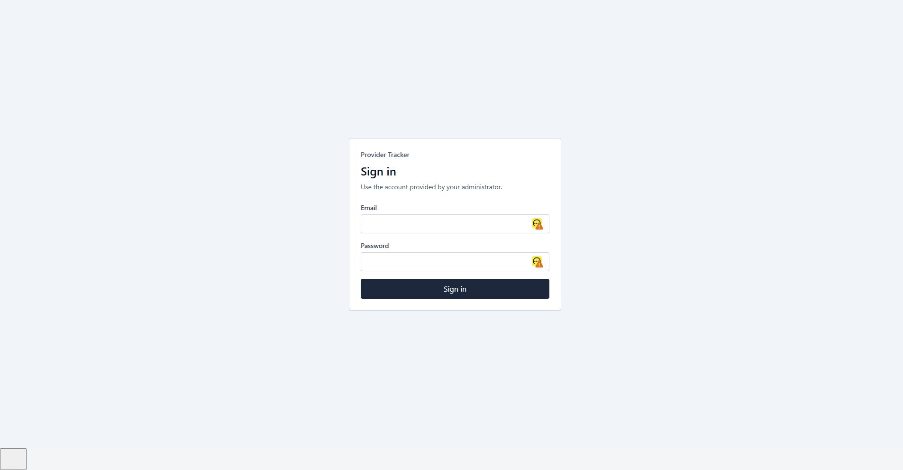
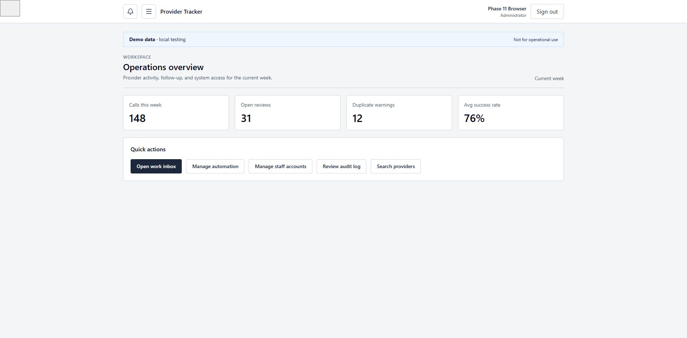
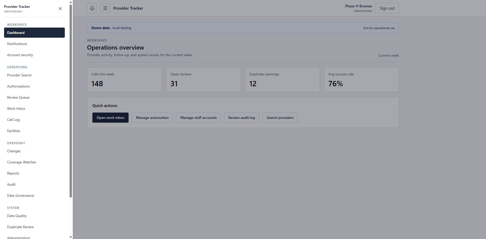
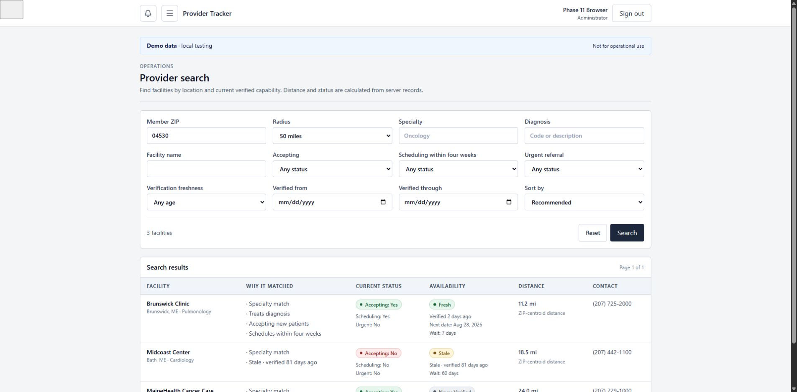

# Phase 11 full-system QA acceptance

Last reviewed: 2026-08-24

## Status

**PHASE 11 FULL-SYSTEM QA PASSED — IT INFRASTRUCTURE VALIDATION STILL PENDING**

The repository, application services, local test database, and primary browser workflows passed the Phase 11 checks. There are no open Critical or High defects. This is not approval to use production data. The infrastructure work listed below still has to be completed in the staging environment.

## Scope

Phase 11 was limited to QA, fixes, and release evidence. It did not add a new product area, change the approved navigation, or expand the compliance scope.

The test work covered:

- authentication and role boundaries;
- provider search, directory paging, verification, contact attempts, and record updates;
- reports, date boundaries, drill-down totals, and raw database reconciliation;
- concurrency, duplicate requests, invalid input, transaction rollback, and database reconnects;
- notifications, work ownership, automation, migration reconciliation, audit integrity, and failure behavior;
- production build, dependency review, source review, load checks, and browser layout checks.

## Synthetic data run

`npm run test:phase11` creates and removes its own data in a database whose name ends in `_test`. Each run uses a unique marker and synthetic email addresses under `example.invalid`.

| Item | Result |
| --- | ---: |
| Facilities | 10,000 |
| Active / archived | 9,901 / 99 |
| Needs review | 588 |
| Availability states represented | 6 |
| Verification events | 12,506 seeded; 12,509 after workflow checks |
| Contact attempts | 3,333 seeded |
| Reverification assignments | 250 |
| Work items | 200 |
| Notifications | 40 |
| Representative users | 7 |
| Database growth during seed | 11 MB |
| Seed time | 334 ms on the local test database |

The data includes all six New England states, active and archived records, stale and current verification dates, review flags, multiple specialties and diagnoses, known and unknown availability, assignments, notifications, work items, audit rows, and migration reconciliation data.

The final cleanup removed the facilities, users, events, contacts, assignments, work, notifications, audit rows, specialties, diagnoses, and migration rows created by the run. A cleanup defect from two earlier QA runs left 22 synthetic audit rows after their users were deleted. Those rows were identified by their exact run window and missing synthetic targets, removed from the local test database, and the cleanup order was fixed. The final audit-integrity check passed with all four failure counts at zero.

## Data and workflow results

The full-system script passed 40 of 40 checks.

- Exact provider search returned one expected record; a known false-positive query returned zero.
- Two 25-row active-directory pages had no overlap.
- Search scoring was deterministic. Portland-to-Bangor distance returned 107.6 miles.
- Report totals matched raw verification rows. Transition totals used distinct facilities and matched their drill-down rows.
- The date test included the start boundary and excluded midnight after the end date.
- A successful verification updated current state and history. An unknown response did not replace the last known-answer timestamp.
- A repeated contact submission stored one attempt and returned the same record ID.
- A failed contact attempt did not change availability.
- Unicode, punctuation, markup-shaped text, and ZIP code `04103` survived database round trips.
- Verification history stayed in newest-first order.
- Concurrent writes produced one success and one visible conflict. A retry preserved both non-conflicting edits.
- A forced transaction error and invalid future verification left no partial write.
- URA users saw only their own notifications and work. Read-only roles could not mutate provider records.
- Synthetic foreign-key checks and latest-history/current-state checks returned zero mismatches.
- Migration reconciliation returned 10,000 of 10,000 rows and 100 percent.
- A database connection restart preserved counts and checksum.

## Permissions and security

The representative role matrix passed 20 of 20 permission checks for Administrator, URA User, Report Viewer, and Auditor. Cross-user notification and work access was also exercised against the database.

The hostile-request and account-compromise suite passed 105 of 105 scenarios. The database privilege suite passed 12 of 12 checks. Dependency-failure checks confirmed that liveness remains available, readiness returns 503, protected metrics stay protected, credentials are redacted, request IDs remain correlated, and maintenance routing works.

The final repository scans found:

- no production dependency vulnerabilities;
- no secret-scan findings;
- no unfinished implementation markers;
- no local instruction files intended for development tools;
- no prohibited authorship or obsolete-project wording.

## Automation, migration, and recovery behavior

| Check | Result |
| --- | --- |
| Automation acceptance | PASS — 16/16 |
| Migration acceptance | PASS — 11/11 |
| Migration performance | PASS — 1,000 rows in 9 ms; 10,000 in 25 ms; 50,000 in 106 ms |
| Automation performance | PASS — 10,000-row dataset; slowest measured query 27.8 ms |
| Governance performance | PASS — 100,000 audit events; 18.1 ms incident query; 24.4 ms deep page |
| Dependency failure behavior | PASS |
| Database reconnect persistence | PASS |
| Backup/restore | LOCAL TOOLING PENDING — `pg_dump.exe` is not installed |

The restore gate failed closed before creating a backup artifact. CI and staging must run it with PostgreSQL client tools installed. No restore success is claimed from this workstation.

## Performance and load

On the 10,000-provider test dataset, provider-directory p95 was 11.2 ms. A bounded database test completed 50 of 50 concurrent directory requests in 84 ms.

The local HTTP load check sent 100 requests at concurrency 10 with zero errors:

| Path | p95 |
| --- | ---: |
| `/api/health` | 113.4 ms |
| `/api/ready` | 108.6 ms |
| `/sign-in` | 197.3 ms |
| `/api/session` | 116.1 ms |
| `/provider-search` | 79.0 ms |

These numbers are local evidence, not a production capacity guarantee. Staging still needs production-like data volume, PostGIS, corporate identity, network controls, monitoring, and representative concurrent users.

## Browser and layout review

The primary Chrome walkthrough covered sign-in plus 19 authenticated routes. Every checked route rendered its expected page heading without an application error. The walkthrough used synthetic demo content; the database-backed behavior was covered separately by the service and integration suites.

1. Sign-in — clear labels, visible primary action, and a direct error path.
2. Operations overview and menu — the menu opens on demand, closes with Escape, and returns focus to the menu button.
3. Provider search — specialty and availability filters returned the expected row and stayed in the URL.
4. Reports — the report loaded and the selected transition drill-down returned its detail row.

Evidence:

No Critical or High desktop-browser layout defect was found. The supported client is a current corporate desktop browser at 1366×768 or larger. Phone and tablet layouts are outside scope. Staging/UAT still needs the managed work-browser version and the organization's desktop accessibility checks.

## Closed defects

| ID | Severity | Problem | Resolution | Proof |
| --- | --- | --- | --- | --- |
| QA11-001 | High | Report transition summaries counted events while the drill-down listed facilities. | Count distinct facilities in both transition summaries. | Raw SQL, summary, and drill-down reconcile in `test:phase11`. |
| QA11-002 | High | Transition drill-down SQL received more bind values than it used and failed at runtime. | Pass only the values used by the selected drill-down query. | Both transition drill-downs pass in `test:phase11`; browser drill-down also loaded. |
| QA11-003 | High | Concurrent repeat contact submissions could create two identical attempts. | Serialize the exact submission signature inside the transaction and return the existing row. | Concurrent submission test stores one row and returns one ID. |
| QA11-004 | Medium | The security test schema did not include the duplicate-candidate table and enum types used by current code. | Bring the isolated security schema in line with the application schema. | Security acceptance passes 105/105. |
| QA11-005 | Medium | QA cleanup deleted synthetic users before deleting their audit rows, detaching 22 synthetic actors. | Delete audit rows by fixture actor and facility before users and facilities. Remove the known stale test rows. | A new 10,000-row run cleans up fully; audit integrity passes 4/4. |

Open defects: 0 Critical, 0 High, 0 Medium, 0 Low.

## Final gate record

| Gate | Result |
| --- | --- |
| Full-system database simulation | PASS — 40/40 |
| Unit and integration | PASS — 33 files, 144 tests |
| Hostile-request/security acceptance | PASS — 105/105 |
| Database privilege | PASS — 12/12 |
| Audit integrity | PASS — 4/4 failure counts at zero |
| ESLint | PASS |
| TypeScript | PASS |
| Production build | PASS — 45 routes/pages |
| Production dependency audit | PASS — 0 vulnerabilities |
| Supply-chain review | PASS — 760 locked packages; 5 install scripts reviewed |
| Static security review | PASS — 149 runtime files; 44 API route files |
| Privacy static review | PASS — 183 files; 0 findings |
| Secret scan | PASS |
| Local HTTP load | PASS — 100 requests, 0 errors |
| Dependency failure behavior | PASS |
| Primary Chrome desktop workflow and layout | PASS with the browser limitations noted above |
| PostGIS staging gate | PENDING — extension is not installed in the local test database |
| Backup/restore gate | PENDING — PostgreSQL client tools are not installed locally |

## IT validation still required

Production approval remains blocked on:

- a PostgreSQL/PostGIS staging database and the spatial correctness/performance gate;
- managed backup creation, restore, retention, encryption, and recovery-time evidence;
- VPN/private DNS, direct-origin blocking, TLS, egress controls, and database network isolation;
- corporate identity, MFA, lifecycle provisioning, service accounts, and emergency access;
- centralized logs, monitoring, alert delivery, dashboards, and on-call routing;
- container build, image scan, registry, runtime limits, and deployment rollback;
- the approved managed desktop browser, screen-reader check, and real-user UAT;
- production-like load, long-running soak, failover, restart, and multi-day automation runs;
- completion of the organizational privacy, legal, records, incident, and security approvals carried forward from earlier phases.

## Repository record

- Starting HEAD: `d14b2792396af911dd598680b43bc26cf4a97857`
- Implementation/test HEAD: `8fbe87e24c5fa8386ecdd604616ad73d7fd4ed64`
- Documentation acceptance HEAD: the commit containing this file; resolve with `git log -1 --format=%H -- docs/PHASE11_QA_ACCEPTANCE.md`
- Branch: `master`
- Commits: `8fbe87e Fix report and contact workflow edge cases`; final QA acceptance record
- Remote: none configured
- Push status: not pushed; Phase 11 did not authorize a push
- Working tree target: clean after the implementation and acceptance commits

The release can move to infrastructure validation after the final repository gate passes on the committed tree. It cannot move to production until the IT items above have evidence and named approval.
